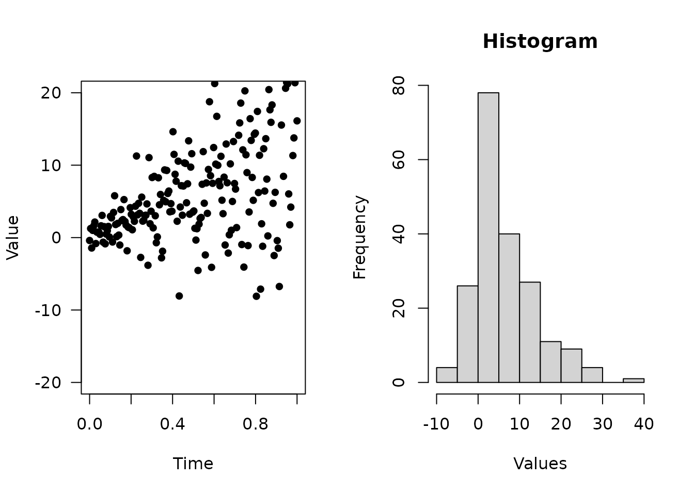

# R Expression Add-on

### 1. `%?<-%`: Assign if invalid

When coding in R, the data checking is actually a headache. For example,
to check if a variable `aa` exists and not `NULL`, otherwise set a
default value to be 1, the check looks like:

``` r
if( exists('aa') && !is.null(aa) ){
  aa <- 1
}
```

Most of time we are repeating ourselves. With `%?<-%` operator, we just
need:

``` r
aa %?<-% 1
print(aa)
#> [1] 1
```

The powerful part is the left-hand side can be any expression. For
example,

``` r
l %?<-% list()

l$aa %?<-% 1

print(l)
#> $aa
#> [1] 1
```

If the value exists, then `%?<-%` does nothing (not even evaluate the
expressions on the right-hand side)

``` r
# e already exists
e <- list(aa = 1)

# %?<-% will not evaluate rhs, nor assign values
system.time({
  e %?<-% { Sys.sleep(10); list(aa = 2) }
  print(e)
})
#> $aa
#> [1] 1
#>    user  system elapsed 
#>   0.000   0.000   0.001
```

### 2. JavaScript-style of creating functions

In modern JavaScript, function can be created via `(arg) => { ... }`.
For example,

``` js
const li = ['A', 'T', 'G', 'C'];
li.map((el, ii) => {
  return(`The index for ${el} is ${ii}`);
});
```

`dipsaus` provides functions `iapply`, and `%=>%`, for example:

``` r
li <- c('A', 'T', 'G', 'C')
li |> iapply(alist(el, ii) %=>% {
  sprintf('The index for %s is %s', el, ii)
})
#> [1] "The index for A is 1" "The index for T is 2" "The index for G is 3"
#> [4] "The index for C is 4"
```

`%=>%` collect the left-hand side elements as arguments and right-hand
side expression as body and create function:

``` r
alist(a, b=a^2, ...) %=>% {
  print(c(a , b,...))
}
#> function (a, b = a^2, ...) 
#> {
#>     print(c(a, b, ...))
#> }
```

### 3. Match nested calls `match_calls`

The function `match.call` provided by base package let us format calls
with formals matched.

``` r
match.call(textInput, call = quote(textInput('inputId', 'label', 'aaa')))
#> textInput(inputId = "inputId", label = "label", value = "aaa")
```

This is already powerful as we can parse the expressions using
[`as.list()`](https://rdrr.io/r/base/list.html) to get the input
parameters. However, when encounter the nested calls like `shiny` UI
components, `match.call` does not work well. We can’t see the matched
results inside of the nested functions.

``` r
match.call(tagList, call = quote(tagList(
  div(
    tags$ul(
      tags$li(textInput('inputId', 'label', 'aaa'))
    )
  )
)))
#> tagList(div(tags$ul(tags$li(textInput("inputId", "label", "aaa")))))
```

`match_calls` solves this problem by recursively calling `match.call`:

``` r
match_calls(call = tagList(
  div(
    tags$ul(
      tags$li(textInput('inputId', 'label', 'aaa'))
    )
  )
), recursive = TRUE)
#> tagList(div(tags$ul(tags$li(textInput(inputId = "inputId", label = "label", 
#>     value = "aaa")))))
```

It can also change modify the calls. For example, we want to add `ns` to
input ID in shiny modules, then the following `replave_args` changes
`"inputId"` to `ns("inputId")`

``` r
match_calls(call = tagList(
  div(
    tags$ul(
      tags$li(textInput('inputId', 'label', 'aaa'))
    )
  )
), recursive = TRUE, replace_args = list(
  'inputId' = function(v, ...){
    as.call(list(quote(ns), v))
  }
))
#> tagList(div(tags$ul(tags$li(textInput(inputId = ns("inputId"), 
#>     label = "label", value = "aaa")))))
```

### 4. Pipe-friendly functions

Pipe functions can simplify the workflow and make R code more readable.
The popular pipe operator `%>%` (or `|>` after R 4.0) allows the
left-hand elements to be the first input of the right-hand side
functions. `dipsaus` provides several pipe-friendly functions.

#### No-operations `no_op`

`no_op` takes whatever input in, and returns the input, with side
effects. For example, we want to plot the results from the pipe and
continue the analysis, usually this is what happens:

``` r
x_tmp <- x |> 
  do_something(...)

plot(x_tmp)

final_results <- x_tmp |> 
  do_others(...) 
```

With `no_op`, the pipe becomes:

``` r
final_results <- x |> 
  do_something(...) |> 
  no_op(plot, ylim = c(0,100)) |> 
  do_others(...)
```

Here’s an example

``` r

par(mfrow = c(1,2))

result <- (1:10) |> 
  iapply(alist(el, ii) %=>% {
    rnorm(20, el, ii)
  }, simplify = FALSE) |> 
  unlist() |> 
  
  # Begin no-ops, result will not change
  no_op({
    # Use expression and "." to refer the data
    print(summary(.))
  }) |> 
  no_op(
    # Use function and pass ... to function
    plot, x = seq(0,1,length.out = 200), 
    type = 'p', ylim = c(-20,20), pch = 16,
    xlab = 'Time', ylab = 'Value', las = 1
  ) |> 
  no_op(hist, xlab = 'Values', main = 'Histogram') 
#>    Min. 1st Qu.  Median    Mean 3rd Qu.    Max. 
#>  -8.101   1.379   4.588   6.344  10.196  35.644
```



``` r

str(result)
#>  num [1:200] -0.4 1.255 -1.437 0.994 1.622 ...
```

#### `do_aggregate`

This is a wrapper of `aggregate` function. When using formula,
`aggregate` requires the formula to be the first element. If the pipe
results are `data.frame` and we want to use formula, it’s super
inconvenient.

    ## S3 method for class 'formula'
    aggregate(formula, data, FUN, ..., subset, na.action = na.omit)

`do_aggregate` allows the first element to be data frames while using
formula:

``` r
ToothGrowth |> 
  do_aggregate(len ~ ., mean)
#>   supp dose   len
#> 1   OJ  0.5 13.23
#> 2   VC  0.5  7.98
#> 3   OJ  1.0 22.70
#> 4   VC  1.0 16.77
#> 5   OJ  2.0 26.06
#> 6   VC  2.0 26.14
```
